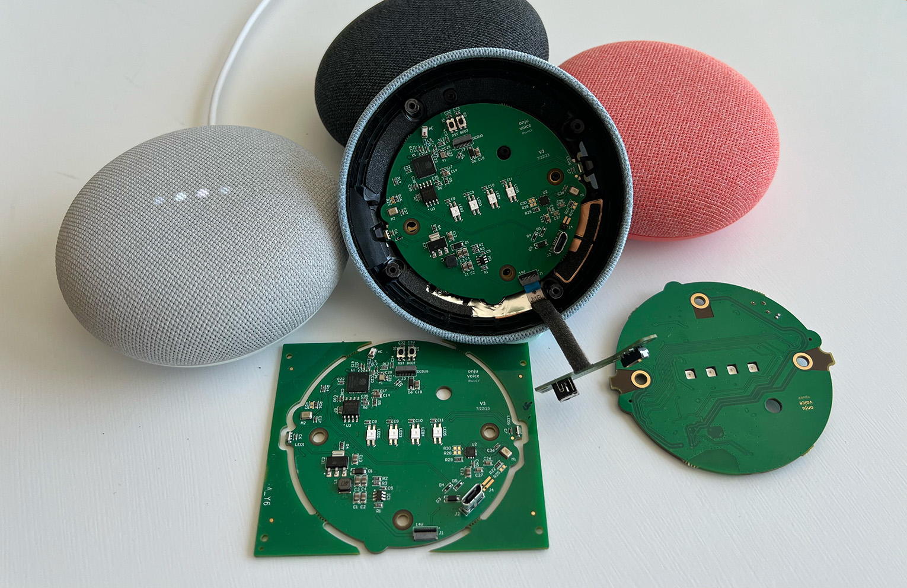
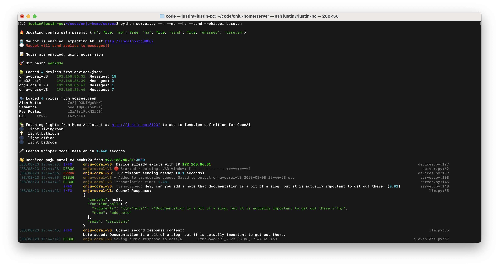
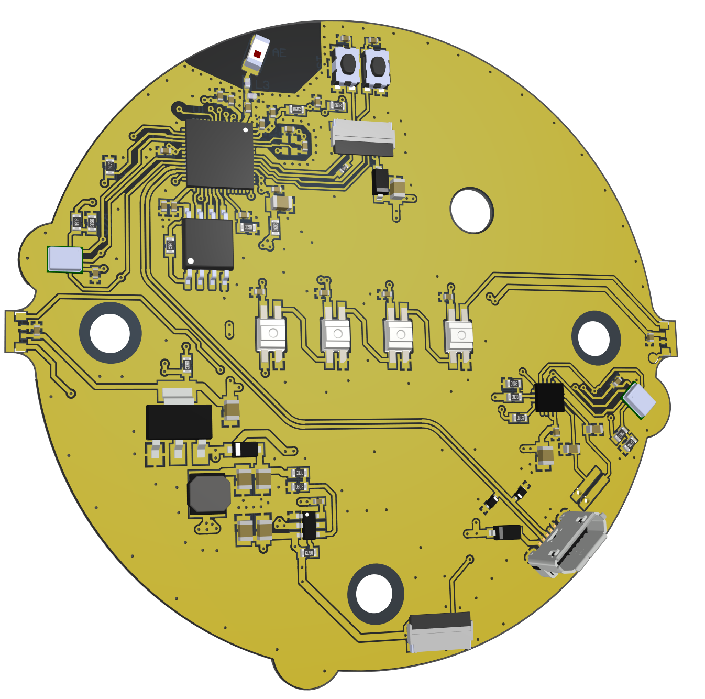
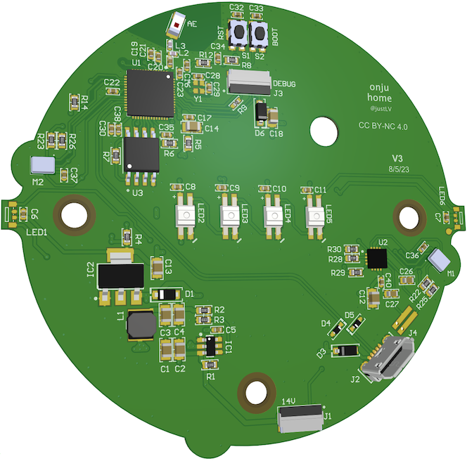

# Onju Voice 🍐🔈

A hackable AI home assistant platform using the Google Nest Mini (2nd gen) form factor, consisting of:
* a custom PCB designed to be a drop-in replacement to the original, using the ESP32-S3 for audio processing
* a server for handling the transcription, response generation and Text-to-Speech from multiple devices on the same network



## Overview

This repo contains firmware, server code and some example applications, intended to be as accessible as possible for getting up and running i.e.:
* [Firmware](#-firmware) for the custom PCB can be programmed using the Arduino IDE and a USB cable (installation of ESP-IDF not required)
* [Server code](#%EF%B8%8F-server) has minimal requirements besides running Whisper locally, and should be able to run on most devices that you can leave plugged in whether MacOS / Linux / Win etc.



## Example applications
* 📩 Querying and replying to messages (using a [Maubot server](https://github.com/justLV/onju-voice-maubot) & Beeper)
* 💡 Light control with [Home Assistant](#-home-assistant)
* 📝 Adding and retrieving notes/memos for the LLM to craft a response with

*Not included:*
* 👥 Multiple voice characters. I’ll leave it to the user to clone voices as they deem fair use. Also from experience LLM’s < GPT4 don’t consistently enough follow instructions to reliably respond in different characters AND perform multiple function calling with complicated prompts.

## Current features of the device <> server platform
* Auto-discovery of devices using multicast announcements
* Remembering conversation history and voice settings for each device
* Sending & receiving audio data from the device, packed as 16-bit, 16kHz (UDP sending, TCP receiving partially buffered into PSRAM)
* Speaker and microphone visualization with the LED’s, and custom LED control via the server
* Mute switch functionality, tap-to-wake for enabling the microphone, and setting mic timeout via the server
* Device-level logging to individual files and console output using `rich`
* [coming soon] SoftAP WiFi provisioning to prevent need for programming WiFi credentials 

## Limitations of this release:
* The Arduino IDE doesn’t (yet) support the Espressif’s Audio SDK’s, such as [ESP-ADF](https://github.com/espressif/esp-adf), [ESP-Skainet](https://github.com/espressif/esp-skainet) etc. For these demo's it's not absolutely required, but if you use Espressif’s ESP-IDF with these SDK's you'd unlock features such as:
  * VAD (Voice Activity Detection) - in this example VAD is offloaded to the server using webrtcvad, and the listening period is extended by either tapping the device or by the server sending mic keep alive timeouts (network traffic is really minimal at 16-bit, 16kHz)
  * AEC (Acoustic Echo Cancellation) - to allow you to effectively talk over the assistant by removing the speaker output from audio input
  * BSS (Blind Source Separation) - let’s you use both mic’s for isolating speakers based on location, and other noise suppression
  * Wakewords and other on-device commands - I’m not a believer in this given how finicky these can be and don’t think these are and think all command logic should be handled by layers of language models on the server.
* The server currently only does transcription locally and uses:
  * OpenAI for generating responses & functions calls, but if you have the hardware you could run a local LLM, using something like ToolLLM for calling API’s to add almost any capabilities you’d wish.
  * Text-to-speech from Elevenlabs - this is fair to say the easiest to get running, fastest and most expressive option out there but FWIR data policy is a little dubious so careful about sending anything too sensitive. I’d really like to see comparable performing open source options that you can run locally
* Conversation flow is highly serialized, i.e. recording > transcription > LLM > TTS needs to finish each step before moving onto the next. Not included here is feeding incomplete transcriptions to a smaller model, and streaming slower LLM's like GPT4 to Elevenlabs and sending streaming responses back, it's currently a little too hacky to include in this release.
* No wakeword usage, mostly done intentionally as I feel uttering a wake-word before every response is a terrible experience. This currently uses a combo of VAD, mic-timeouts sent from server, tap-to-wake, mute switch usage etc. Not included here is experiments running a smaller, faster LLM for classification with a running transcription before handing off to a larger LLM with specific prompt

## Other areas for improvement
These are things I didn't get time to implement but I believe would be invaluable and pretty achievable
* Speaker diarization - know who is saying what, and have the LLM enage in multi-user conversations or infer when it isn't being spoken to
* Interruptions - requires AEC for simultaneous listening and playback
* Smaller local models/LLM's for running classification, detecting intent and routing to larger LLM's

# Installation

## 🖥️ Server

Ensure you can install [Whisper](https://github.com/openai/whisper) and run at least the base model, following any debugging steps they have if not. If you can get past that, it should be as simple as:
```
cd server
pip install -r requirements.txt
```

Adjust settings in the `config.yaml`, and tweak aspects such as how much silence is needed to start processing to trade-off snappiness vs avoiding cutting off the user.

Add your Elevenlabs token to `credentials.json` and ensure you have a cloned voice in your account that you set in the `config.yaml` under `elevenlabs_default_voice`
 
You'll also need a greeting WAV set in `config.yaml` under `greeting_wav`, that will be sent to devices on connecting to the WiFi. This is up to you to record or procure ([e.g.](https://github.com/ytdl-org/youtube-dl))

A small subset of the config parameters can be set as optional arguments when running the script. For e.g. the following will run the server with note-taking, Home Assistant, Maubot, real sending of messages enabled (a safe guard disabled by default), and a smaller English only Whisper model for transcription.

`python server.py --n --ha --mb --send --whisper base.en`

### 🏡 Home Assistant
I recommend setting this up on the same server or one that is always plugged in on your network, following the [Docker Compose instructions](https://www.home-assistant.io/installation/linux#docker-compose)

Then go through the onboarding, setup a user, name your devices and get a Long Lived token to add to `credentials.json` together with the URL e.g. `http://my-local-server:8123/`

### 🤖 Maubot
Follow instructions [here](https://github.com/justLV/onju-home-maubot) to setup Maubot with your Beeper account. Ensure the correct URL is setup in `config.yaml`, set `send_replies` to True if your friends are forgiving of the odd mistakes, and set a `footer`.

Don’t have Beeper yet and can’t wait? [Try setup a Matrix bridge yourself](https://docs.mau.fi/bridges/go/imessage/mac/setup.html) and a custom function definition for OpenAI function calling (and share how you did it!)

Following this example you can also integrate e-mail.

## 📟 Firmware

Irrespective of what you use for development, the quickest & least error prone setup for building & flashing firmware is probably installing the Arduino IDE [Software](https://www.arduino.cc/en/software), and then using this IDE or your preference i.e. VSCode for development (Copilot)

* Add the ESP32 boards as detailed [here](https://docs.espressif.com/projects/arduino-esp32/en/latest/installing.html)
TL;DR add `https://espressif.github.io/arduino-esp32/package_esp32_index.json` to In Preferences > Additional Boards Manager URL’s
* Under Boards Manager, install “esp32” by Espressif Systems
* Under Library Manager, install “Adafruit NeoPixel Library” 
* Clone this repo to `Documents/Arduino` for simplicity. 
* Add your WiFi credentials to `credentials.h`
* Run `bash setup-git-hash.sh` to add a header with the git-hash (optional). This will then automatically update after commits, and help track the firmware that your devices are running from the server side.
* Open File > Sketchbook > onju-home > onjuino
* Select Tools > Board > esp32 > ESP32S3 Dev Module
* Under Tools ensure:
    * USB CDC on Boot set to Enabled
    * PSRAM set to OPI PSRAM
    * Board is plugged in and Port is selected (you may need to install USB bridge drivers as detailed by Espressif, don’t worry if name is incorrect)
* Build and upload
* If not reset, press the reset button. In Serial Monitor you can also send `r` to reset the device (assuming it is already booted)

## 🧩 Hardware 

<p float="left">
  
   
</p>

[Schematics & PCB preview](https://365.altium.com/files/C44B8519-69BA-464B-A221-24D527B89E2C)

PCB's will be made available from Crowd Supply, to leverage their fulfillment expertize and bulk ordering.

I will be sharing more detailed instructions for replacement.

Replacement gaskets for the microphone & LED's can be made using [adhesive foam](https://www.amazon.com/gp/product/B07KCJ31J9) and a [punch set](https://www.amazon.com/gp/product/B087D2Z43F)) for example

## ❓Questions

### Does this replace my Google Nest Mini?

While this replicates the interfaces of the Google Nest Mini, don’t expect this to be a 1:1 replacement, for e.g. it is not intended to be a music playback device (although there is probably no reason it couldn’t be developed to be used as such). It’s also worth re-iterating that like the Google Nest Mini, this requires a separate server, although this can be in your home running local models instead of in a Google datacenter. 
**The original is well tested, maintained, certified and works out the box, while this is essentially a dev board with some neat examples for you to build on top of**

### What if I don’t have a Google Nest Mini but still want to use this?

Fortunately they’re still being sold, you may find deals for <$40 which is pretty good for the quality of speaker and form factor. I picked up quite a few from eBay, just make sure you get the 2nd gen.

The adventurous can get try replacement shells from [AliExpress](https://www.aliexpress.us/item/3256803723188315.html) for e.g., but you’ll still need a base, power input, mute switch, speaker & mount, capacitive touch panels, and replacement gaskets etc. A hero out there could design a custom enclosure that fits an off-the-shelf speaker.

### But I’m really impatient and want to get hacking away! What can I do?

a) if you can commit to making significant contributions to the codebase and/or major contributions to the board design or RF review, we may be able to make early samples available

b) if you don’t need the form factor, don’t mind rolling up my sleeves, and have some HW experience, you can breadboard it out with readily available components until you can get your hands on an order. Here are the components that should be able to get a demo running (🌸 Adafruit link for convenience but shop around wherever you’d like)

* ESP32-S3 devboard, ideally w/ PSRAM (e.g. [QT Py S3](https://www.adafruit.com/product/5700) or [ESP32-S3](https://www.adafruit.com/product/5364))
* [Microphone](https://www.adafruit.com/product/3421) (only need 1 for the Arduino implementation, ensure it's a SPH0645 to limit debugging)
* [Amplifier](https://www.adafruit.com/product/3006)
* [Speaker](https://www.adafruit.com/product/1313)
* [Neopixel LED strip](https://www.adafruit.com/product/1426) - just set the firmware to the correct #
* [Breadboard & wire kit](https://www.adafruit.com/product/3314)  (you can use protruding pieces of wire for cap touch)

You'll need to update the `custom_boards.h` with your pin mapping

## **🍐 PR's, issues, suggestions & general feedback welcome!🏡**
